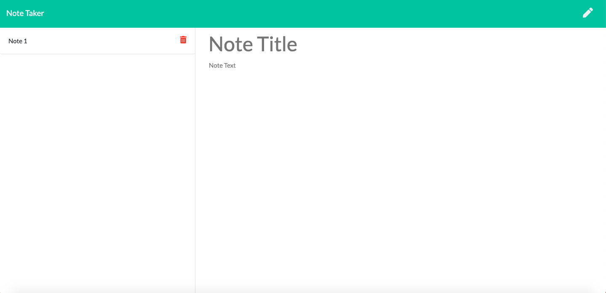

# Note Taker Application

This application is used to write, save, and delete notes to an Express js server.

## Installation

Install the following packages and required methods.

```bash
npm install,   require express
npm init -y,   require path
npm install mysql
```



=======


## Usage

```python
Click the "Get Started" button on the home page. 
Enter a title for your note.
Enter text content for your note.
Click the save icon to add it to your list of saved notes (which will appear on the left side of the screen).
Click the delete icon to remove your desired note. 
Click the write icon to create a new note.
```

## Contributing

Special thanks to Crystal and Anthony Ly for their help. 

